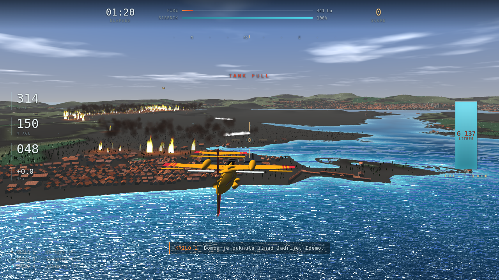
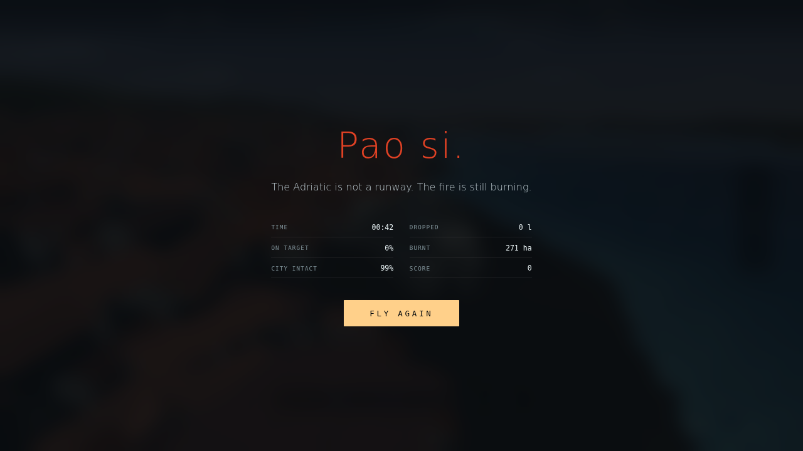

# Flamme Retardé — a Canadair over Šibenik

Fires rage in Dalmatia. A cluster bomblet left in the karst since the war has
cooked off in the August heat, the hillside above **Jadrija** is alight, and the
*lebić* is pushing it up the peninsula at an eight-hundred-year-old stone town.
You are one of four Canadair CL-415s. Scoop the Adriatic, drop on the fire, and
be faster than it.

**Live: [flamme-retarde.edeliverables.com](https://flamme-retarde.edeliverables.com/)**
— or clone and open **`flamme-retarde.html`** directly. It is one self-contained
file: no server, no build step to play it, no network requests, no dependencies
beyond Three.js, which is inlined.

Based on a true story, and on a real place. The terrain is the actual karst, the
coastline is the actual coastline, and every one of the thirteen thousand houses
is a real footprint.



---

## Playing it

| key | |
|---|---|
| mouse | fly — the virtual stick springs back to centre on its own |
| `↑ ↓ ← →` | fly, held — no spring, if you prefer a steady input |
| `W` `S` | throttle |
| `A` `D` | rudder |
| `Z` | **hold to level the wings** — the panic button |
| `T` | **autopilot** — flies you to the water, or to the fire, whichever the job is |
| `SPACE` | scoop (hold it; wings level, under 14 m, over open water) |
| `F` / left click | drop |
| `shift` | flaps |
| `C` | camera — chase, close, cockpit, wing |
| `M` | settings — language, stability assist, volume, vegetation, traffic, FOV, exposure |
| `P` / `Esc` | **pause** — the fire stops too |
| `H` | hide the HUD |

The autopilot is a *fly me to the job* button, not an autoplayer: it lines the
aeroplane up on a scoop run or brings you in over the fire, and hands the scoop
and the drop back to you. Any real stick input disengages it.

Pause really is a pause: the simulation stops where it stood, the fire stops
spreading, the engines duck to silence, and the clock does not collect the
interval and hand it back as one enormous step when you return. It also pauses
itself if you switch tabs or lose the pointer lock, so nothing burns down while
you are somewhere else.

**On a phone or a tablet**, drag anywhere on the left half to fly — the stick
appears under your thumb wherever you put it — and the throttle is the lever on
the right. `SCOOP` and `DROP` are held, not tapped. `LVL` latches. Landscape.

**Languages: English, Croatian, French**, switchable in the settings panel at
any time, including mid-flight. It starts in whichever of the three your
browser asks for, and English otherwise.

`?nointro` skips the cinematic. `?q=low|mid|high` forces a detail level.
`?touch` / `?notouch` force the control scheme.

---

## How it is made

**Everything you fly over is derived from public data.** Elevation comes from
AWS Terrarium tiles (RGB-packed metres, z=14); the coastline, land cover,
building footprints, roads and landmark positions come from OpenStreetMap via
Overpass. `tools/bake.py` turns 17 MB of that into a 6 MB payload: a 2048²
height field encoded 16-bit across the red and green channels of a PNG, a cover
raster, and gzipped JSON for the town. The browser decodes the PNG through a
canvas and the JSON through `DecompressionStream`. Nothing is fetched at run
time.

**Every building has openings, and none of them are geometry.** Windows, doors,
sills, lintels, shutters and a string course at each floor line are all
fragment-shader tests — which is the only way thirteen thousand buildings can
afford a facade. The wall carries two numbers in the one spare UV the shared
material already had: metres along the frontage, run cumulatively so a wall that
OSM happens to have split into three nodes keeps one window rhythm, and metres
above that building's *own* doorstep, so a house on a hillside takes its floors
from its own ground line rather than from sea level. The wall's height rides in
the same float, because a window may only be drawn where the whole storey it
belongs to actually exists — otherwise the roofline slices the top row in half.

**The town is 13 343 real footprints, and OSM knows more about them than a
height.** 2 456 carry a roof shape, and 82% of those are hipped — so the roofs
are hipped, gabled, flat with a parapet, pyramidal, skillion and barrel as
tagged. The 11 234 that say nothing are not given a default: they are drawn
from that distribution, conditioned on how narrow and how hemmed-in the
footprint is, because a continuous terrace on a narrow plot is gabled where a
detached villa is hipped on all four sides. Tagged colours win over the
palette.

**The roads are the ones in the data**, 320 km of them, draped on the terrain
and mitred through the bends. Water crossings are cut rather than laid flat on
the sea, so the Šibenik bridge is a gap: a bridge deck is geometry, not a
ribbon.

**The traffic, the boats and the parasols are placed from the rasters**, not
from OSM — cover says where the water is, the shore channel how far the
waterline is, the urban channel where people are. They are there for scale: a
four-metre car is the only object in the scene that reads as *small*. There are
no people, because from a hundred metres a person is one pixel and a parasol is
six, and they say the same thing.

**The fire is a cellular automaton on a 256² grid** that reads its fuel from the
land cover — bare limestone is the natural firebreak, maquis is the reason the
whole coast goes up. Spread is driven by wind, slope (fire runs uphill, because
flames preheat the fuel above them), moisture and fuel load, and embers spot
downwind. The old town is unreachable by ground from the ignition point; the
only way the cathedral burns is by spotting across the channel, which is what
the whole mission is really about.

**The vegetation is placed from the same cover map the fire reads**, so a tree
standing in a burning cell is a tree standing in a burning cell — it chars and
shrinks as its cell's fuel goes. Aleppo pine, cypress, olive and maquis scrub,
generated per 512 m tile from a positional hash so a tree is always in the same
place, repacked into four instance buffers.

**The four landmarks are modelled in Blender** — St James' Cathedral, the
fortress of St Nicholas, the fortress of St Michael, and the Jadrija lighthouse
— and baked to a small binary blob (position, normal, colour, index) so there is
no glTF parser in the bundle. `tools/blender/landmarks.py` builds them
procedurally with bmesh and leaves `build/landmarks.blend` behind for hand
editing. Everything else — the aircraft, the town, the sea, the sky, the fire,
the water — is generated in code.

**The sea** is a camera-centred grid with a radial exponential warp, so the
triangles are dense at your feet and kilometres wide at the horizon, and the
noise detail is chosen per-pixel from `fwidth` rather than per-vertex.

**The audio is synthesised**, all of it: pink noise shaped into engine and
airflow beds, blade-pass oscillators at four times shaft speed, inharmonic bell
partials for the bomblets, and a convolution reverb whose impulse response is
built at load time from a few discrete slap-backs off the hillsides plus a
decaying noise tail.

**The intro panels are painted.** Ten of them, generated with Gemini 2.5 Flash
Image from the reference photographs, cross-fading over the live 3-D on a slow
push, so the film cuts between painting and engine. `tools/gen_panels.py`
regenerates them; the prompts are in the file.

**Nothing warns you about the ground unless it should.** There is a real ground
proximity system — a radio-altimeter tick that speeds up as the ground comes
up, SINK RATE for a descent too steep for the height, and the swept PULL UP
whoop when the terrain *ahead* is going to win rather than the terrain below.
All of it inhibits itself the moment the scoop conditions are met, because being
five metres over the sea is the job and an alarm you hear on every fill is an
alarm you stop hearing.



---

## Building it

Playing needs nothing. Rebuilding `flamme-retarde.html` needs Python 3:

```sh
python3 build.py          # concatenate src/, inline the payload, deploy
```

`build.py` downloads and rewrites Three.js into `vendor/` on first run, runs
`node --check` on the concatenated app before shipping it, and writes the single
HTML file.

To regenerate the world from scratch (needs network, and is slow):

```sh
python3 tools/fetch_dem.py     # AWS Terrarium elevation tiles
python3 tools/fetch_osm.py     # Overpass: coastline, landcover, buildings, roads
python3 tools/bake.py          # -> build/payload
```

To rebuild the landmarks (needs Blender 4.x on `PATH`):

```sh
blender --background --python tools/blender/landmarks.py
```

To regenerate the intro panels (needs `GEMINI_API_KEY` and the reference
photographs, which are not in this repository — see `refs/README.md`):

```sh
python3 tools/gen_panels.py
```

`tools/shoot.mjs` drives a software-GL headless Chrome over CDP to capture
frames, and `window.__fr` exposes hooks for it — including `fastForward(secs)`,
which steps the simulation without rendering.

Changes are tracked in [CHANGELOG.md](CHANGELOG.md).

---

## Sources and credits

- Terrain: [AWS Terrain Tiles](https://registry.opendata.aws/terrain-tiles/) (Terrarium), public domain.
- Coastline, land cover, buildings, roads, landmarks: © OpenStreetMap contributors, [ODbL](https://www.openstreetmap.org/copyright).
- [Three.js](https://threejs.org), MIT.
- Intro panels generated with Google Gemini 2.5 Flash Image from reference photographs.

## What actually happened

The fire in the intro is a real fire. On **6 August 2024**, reported at 12:52,
the pine wood at **Rokići** above Šibenik went up in the afternoon heat, close
to the coast road and to housing. Around twenty past one the hillside began
detonating: Homeland-War cluster submunitions — the ones Croatia calls
***zvončići***, little bells, for the sound they made coming down — cooking off
in the fire, thirty years after they were dropped and never went off. The
Adriatic Highway above Rokići was closed and the area lost power. Something
under sixty firefighters with twenty-odd vehicles worked it from the ground,
and **four Canadairs** and an Air Tractor worked it from the air. Three and a
half hectares burned. Nobody was killed.

The game takes two liberties with that, both on purpose. It moves the fire
across the channel to the hills above **Jadrija**, because a fire the ground
crews genuinely cannot reach is the only kind that *has* to be fought from the
air, and that is the game. And the bomblet that lights it is the game's own.
Everything else in the cinematic — the weapon, the name, the roughly one in
twenty that never went off, the date, the place, the four aircraft — is a matter
of record.

Reporting: [morski.hr](https://www.morski.hr/zaustavljena-buktinja-u-sibeniku-izgorjelo-3-5-hektara-ostaju-gasiti-tri-zrakoplova/),
[ŠibenikIN](https://www.sibenik.in/crna-kronika/pozar-i-dalje-aktivan-no-pod-kontrolom-je-vatrogasaca-izgorjela-je-povrsina-od-oko-3-5-hektara/),
[Index.hr](https://index.hr/vijesti/clanak/iznad-sibenika-izbio-pozar-blizu-kuca-je-cuju-se-detonacije-moze-biti-opasno/2588456.aspx),
[N1](https://n1info.hr/vijesti/pozar-sibenik-06082024/).
